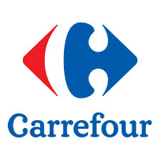

<h1 align="center">
  <br>
  
  <br>
  🛍️ shopwise
  <br>
</h1>

<h4 align="center">A python package to get the best price on your shoplist.</h4>


## ⚠️ Disclaimer

This repository is under continuous development. Some supermarkets may not be fully implemented yet. The registry implemented address the task as scraping but actually it is not pure scraping. The naming will be changed.

## 📋 Features

- [ ] **Supermarket shoplist**: Process your shoplist w.r.t several supermarkets to find the best price at the moment.
- [ ] **Similarity search**: Take a photo of your product and look for similar objects in the market

## ⚙️ Installation

To install **shopwise** you can clone the repository and use pip.

1. Clone the repository.

   ```ssh
   git clone https://german36-del/Shopwise.git
   cd Shopwise
   ```

2. Install the tool using pip.

- Just use it (not recommended).

  ```ssh
  pip install .
  ```

- Editable mode.

  ```ssh
  pip install -e .
  ```
## 🖥️ Usage

**shopwise** can be accessed through both the Command-Line Interface (CLI) and Python code. The default parameters are configured in the `shopwise/cfg/default.yaml` file, and overwritten by the specified arguments in the CLI or Python calls.

### CLI

**shopwise** may be used directly in the Command Line Interface (CLI), with the following command format:

```ssh
shopwise <task> <arg1=value2> <arg2=value2> ...
```

For example:

```ssh
shopwise supermarket save_scrap=True
```

### Python

Shopwise may also be used directly in a Python environment, and it accepts the same arguments as in the CLI example above:

```python
from shopwise import shopwise

# Find the best price for your shoplist!!
shopwise(save_scrap=True, supermarkets=["mercadona", "alcampo"])
```

## 🛒 Supported Supermarkets

<div style="display: grid; grid-template-columns: repeat(auto-fit, minmax(150px, 1fr)); gap: 20px; max-width: 1000px; margin: 0 auto; padding: 20px;">

<div style="border: 1px solid #ddd; border-radius: 10px; padding: 10px; text-align: center; background-color: #f9f9f9; box-shadow: 2px 2px 12px rgba(0, 0, 0, 0.1);">
        
</div>

<div style="border: 1px solid #ddd; border-radius: 10px; padding: 10px; text-align: center; background-color: #f9f9f9; box-shadow: 2px 2px 12px rgba(0, 0, 0, 0.1);">
        
</div>

<div style="border: 1px solid #ddd; border-radius: 10px; padding: 10px; text-align: center; background-color: #f9f9f9; box-shadow: 2px 2px 12px rgba(0, 0, 0, 0.1);">
        
</div>

<div style="border: 1px solid #ddd; border-radius: 10px; padding: 10px; text-align: center; background-color: #f9f9f9; box-shadow: 2px 2px 12px rgba(0, 0, 0, 0.1);">
        
</div>

<div style="border: 1px solid #ddd; border-radius: 10px; padding: 10px; text-align: center; background-color: #f9f9f9; box-shadow: 2px 2px 12px rgba(0, 0, 0, 0.1);">
        
</div>
</div>
